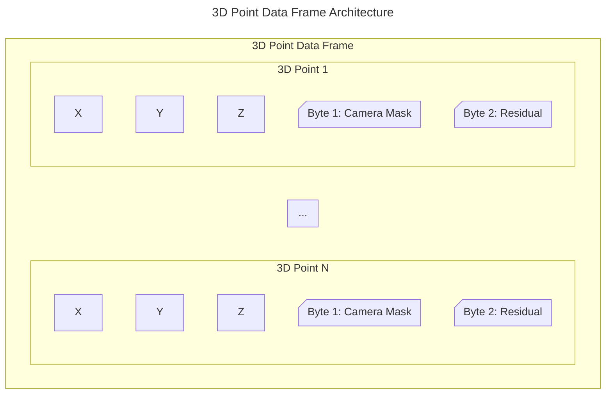

# 3D Point Data

A positive [POINT:SCALE](../parameters/required/point-scale_factor.md) Parameter value indicates
that the 3D Point and Analog Data are stored using Signed Int16 format. A negative value indicate that the 3D Point and Analog Data are stored using Float32.

When a C3D file contains signed integer 3D data then any corresponding
analog data values must also be stored in signed integer format.

Within each Data Frame, the 3D Points are stored in the order that they are listed in the parameter [POINT:LABELS](../parameters/required/point-labels.md), followed by the Analog Data Frame if any Analog Data is present.

## Structure

### Signed Int16

| Word | Length (bytes) | Type   | Description                                                                                     |
|-|----------------|--------|-------------------------------------------------------------------------------------------------|
| 1 | 2              | Signed Int16  | X value divided by SCALE:FACTOR.                                                                |
| 2 | 2              | Signed Int16  | Y value divided by SCALE:FACTOR.                                                                |
| 3 | 2              | Signed Int16  | Z value divided by SCALE:FACTOR.                                                                |
| 4 | 2              | Signed Int16  | Byte 1: `abcd efgh`. `a`: Residual sign. `b-g`: Camera Mask. Byte 2: Average residual divided by SCALE:FACTOR. |

### Float32

| Word | Length (bytes) | Type   | Description                                                                                     |
|-|----------------|--------|-------------------------------------------------------------------------------------------------|
| 1 - 2 | 4              | Float32| X value.                                                                |
| 3 - 4 | 4              | Float32| Y value.                                                                |
| 5 - 6 | 4              | Float32| Z value.                                                                |
| 7 - 8 | 4              | Float32| After converting its value to Signed Int16. Byte 1: `abcd efgh`. `a`: Residual sign. `b-g`: Camera Mask. Byte 2: Average residual divided by SCALE:FACTOR. |

## Int16

The first three Signed Int16 words record the X, Y, and Z coordinate values of the 3D Point, each divided by the Float32 [POINT:SCALE](../parameters/required/point-scale_factor.md) parameter value. Word 4 of the 3D Point record is comprised of two bytes in the order determined by the endian format used by the C3D file. 

The first byte stores which Camera provided information used in calculating the 3D Point. The second byte contains the average residual for the 3D Point measurement. The residual value, in [POINT:UNITS](../parameters/required/point-units.md), is a measurement of the accuracy of each point. The calculation of the residual is performed by the photogrammetry
software and depends on the software that generates the value.

## Float32

This format provides increased precision and, since the data is stored as scaled values, the [POINT:SCALE](../parameters/required/point-scale_factor.md) parameter is not used to apply a scaling factor to the data. However, please note that a valid scaling factor is still required, as the [POINT:SCALE](../parameters/required/point-scale_factor.md) parameter is still used to calculate the 3D Point Residual value. Also, but less likely, the [POINT:SCALE](../parameters/required/point-scale_factor.md) can also be used to convert a Float32 file into a Int16 file. Therefore, it is still important to calculate a valid [POINT:SCALE](../parameters/required/point-scale_factor.md) factor when 3D Points are stored as Float32 values. 

Since the Float32 format require eight 16-bit words to store a single 3D Point, it will result in C3D files that are double the size of integer format C3D files.

> If the 3D data points are stored in floating-point format, the X, Y, and Z
coordinates have been already multiplied by the scale factor.

> A valid [POINT:SCALE](../parameters/required/point-scale_factor.md) should still be calculated, based on the maximum coordinate value and not just set to -1.

## Camera Mask and Residual

<table style="width:100%; text-align:center;">
  <thead>
    <tr>
        <th colspan="8">Byte 1</th>
        <th colspan="8" style="border-left: 3px #5C5C5C;">Byte 2</th>
    </tr>
  </thead>
  <tbody>
    <tr>
        <td>B8</td>
        <td>B7</td>
        <td>B6</td>
        <td>B5</td>
        <td>B4</td>
        <td>B3</td>
        <td>B2</td>
        <td>B1</td>
        <td style="border-left: 3px #5C5C5C;">B8</td>
        <td>B7</td>
        <td>B6</td>
        <td>B5</td>
        <td>B4</td>
        <td>B3</td>
        <td>B2</td>
        <td>B1</td>
    </tr>
    <tr>
        <td>+/-</td>
        <td>Camera 7</td>
        <td>Camera 6</td>
        <td>Camera 5</td>
        <td>Camera 4</td>
        <td>Camera 3</td>
        <td>Camera 2</td>
        <td>Camera 1</td>
        <td colspan="8" style="border-left: 3px #5C5C5C;">3D Point Residual value</td>
    </tr>
  </tbody>
</table>

> The Byte 1 and Byte 2 position, for the Camera Mask and Residual values, are determined by the endianness of the processor of the machine creating the file.

The 3D Point Residual is a measurement that provides information about the relative accuracy of the 3D measurement and must be multiplied by the [POINT:SCALE](../parameters/required/point-scale_factor.md) parameter to obtain a physical world scaled value.

When the 3D Point Data is recorded as Float32, Word 7 - 8 represents the Camera Mask and Residual value. It is a Float32 value that must be converted to a Signed Int16 and then interpreted as two bytes. A simple cast will do as the value will be of the format: "XYZ.0000". Once the conversion happened, the interpretation of the two bytes are the same as when the 3D Point Data is recorded as Signed Int16.

The Camera Mask is optional but the 3D Point Residual is a measurement that, if calculated and stored correctly, provides important information about the relative accuracy of each individual 3D measurement recorded in the C3D file. The convention is that a valid residual indicates that the 3D coordinate is a measurement; a negative residual value indicates that the [3D coordinates are invalid](#invalid-3d-point), while a residual set to zero indicates that the 3D coordinate has been processed and is not the original measured value. In practice, this convention is rarely used and cannot be relied upon.

### Byte 1

Byte 1 of Word 4 has seven bits that indicate the contribution, or not, of Camera 1 to 7 in the position computation of the 3D Point. If Camera X contributed to the measurement of the 3D Point, the bit corresponding to Camera X is set to `1`. If Camera X didn't contribute to the measurement of the 3D Point, then the bit corresponding the Camera X is set to `0`. Bit 1 represents the Camera 1, bit 2 the Camera 2, etc. 

By convention, all camera bits will be set to 0 if the point value has been interpolated, filtered or otherwise modified in any way. In practice, this convention is not applied strictly and this information cannot be deemed truthful. Note that the camera bits are in the high byte of word 4 of the integer record: the most significant bit of this word is the Residual
sign bit. Therefore, there are only seven bits available for the cameras, so the camera mask only
supports seven cameras.

Setting the 8th bit produces a negative signed integer, and any point with a negative residual is [interpreted as invalid](#invalid-3d-point), in theory. But this convention cannot be trusted in practice. 

### Byte 2

Byte 2 of Word 4 represents the average of the residuals for the measurement of the 3D Point. The value from Byte 2 needs to be multiplied by the [POINT:SCALE](../parameters/required/point-scale_factor.md) parameter to be interpreted. If byte 2 is zero then the 3D point is recorded as having been filtered, interpolated, or otherwise modified and is not a measured point. This convention is not always implemented in practice, be it when reading or writting a C3D file and should therefor not relied upon for every sources.

## Invalid 3D Point

In theory, if a point is invalid then the fourth word (camera mask and residual) will be negative and the X, Y and Z coordinate values will be ignored because the residual of -1 indicates that the point is invalid. In practice, this is seldom respected by any applications, either when reading or writing a file. The validity of a 3D Point cannot be considered truthful and the default behavior is to believe any 3D Point is valid.