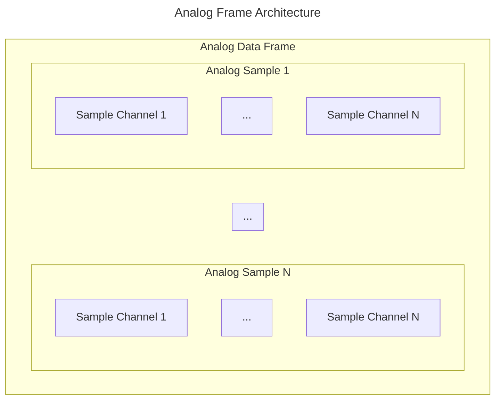
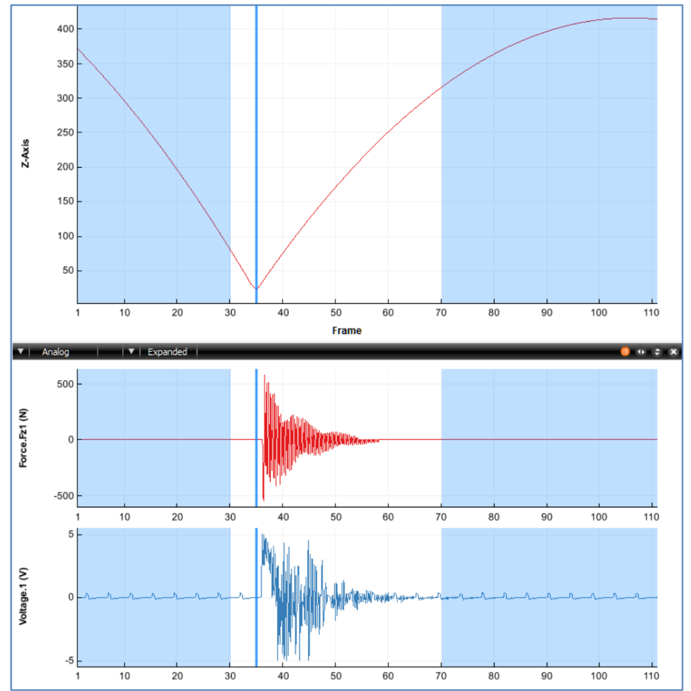

# Analog Data

> A positive [POINT:SCALE](../parameters/required/point-scale_factor.md) Parameter value indicates
that the 3D Point and Analog Data are stored using Signed Int16 format. A negative value indicate that the 3D Point and Analog Data are stored using Float32.

Although the method of storing the analog sample values is different between the Signed Int16 and Float32 versions of the C3D file format, both versions organize the individual Analog Data samples in the same way within the Data Frames of the C3D file. 

The C3D file format is designed to store synchronized 3D data and analog data. Thus, when analog data is present in the C3D file, each 3D frame is followed by one or more analog samples for each analog channel. 3D measurements are recorded at fixed intervals (set by the [POINT:RATE](../parameters/required/point-rate.md) parameter) and multiple analog samples, recorded at fixed intervals within each 3D frame. The Analog record for each Data Frames can contain one or more Analog Data samples where each Analog Data sample consists of one or more analog measurements (channels) during the 3D frame sample period. The parameter [ANALOG:RATE](../parameters/required/analog-rate.md) stores the total number of analog data samples per 3D frame while the parameter [ANALOG:USED](../parameters/required/analog-used.md) stores the number of analog measurements, or channels, within each Analog Data sample. All of this data is recorded at a 3D Point Data Frame rate whose value is recorded in the [POINT:RATE](../parameters/required/point-rate.md) parameter. For example, if the 3D Point Data is sampled every 20ms (50Hz frame rate) and each 3D frame has 5
Analog Data Frame samples then the Analog channels are sampled every 4ms within the 3D Data Frame.

## Structure

For example, consider a C3D file that contains 3D Point Data that has been recorded at 60Hz, and contains 18 Analog channels that have each been sampled at a rate of 1200Hz. This information is stored in the C3D file in the following parameters:

- [POINT:RATE](../parameters/required/point-rate.md) = 60
- [ANALOG:USED](../parameters/required/analog-used.md) = 18
- [ANALOG:RATE](../parameters/required/analog-rate.md) = 1200

Thus the Analog Data will be written with each individual Analog record containing 18 values: one value per analog channel recorded, as indicated in the [ANALOG:USED](../parameters/required/analog-used.md) parameter. Each Analog channel is sampled 20 per 3D Point Data Frame.

The number of channels sampled is not stored in the C3D Header directly but can be calculated as [total analog samples per 3D frame](../c3d-header.md#word-3-total-number-of-analog-samples-per-data-frames) / [number of samples per analog channel](../c3d-header.md#word-10-number-of-analog-frame-per-data-frame) ([Word 3](../c3d-header.md#word-3-total-number-of-analog-samples-per-data-frames) / [Word 10](../c3d-header.md#word-10-number-of-analog-frame-per-data-frame)) or read even be read from the Parameter [ANALOG:USED](../parameters/required/analog-used.md).

The C3D file does not directly store the number of Total Analog Data samples per frame as
a parameter. This value is calculated by dividing the [ANALOG:RATE](../parameters/required/analog-rate.md) value by the
[POINT:RATE](../parameters/required/point-rate.md) value.

The number of Analog Data Frame per Data Frame value is stored in [Word 10](../c3d-header.md#word-10-number-of-analog-frame-per-data-frame) of the [C3D Header section](../c3d-header.md), together with a count of the total number of Analog Data samples per Data Frame in [Word 3](../c3d-header.md#word-3-total-number-of-analog-samples-per-data-frames), so that the analog data can be quickly read by any application that opens a C3D file without having to read and interpret values from the [Parameter Section](../parameters/c3d-parameter-section.md) of the C3D file.

## Synchronization

The synchronization, or timing accuracy between the 3D and Analog data, depends on the hardware data collection system and the signal latency of any devices connected to the analog sampling system. While the C3D format is capable of recording 3D and
analog data with perfect synchronization, analog devices connected to a 3D data collection system by a USB interface, may have significant signal latencies that can result poor synchronization of the recorded data.

It is the responsibility of the Motion Capture system to document the latencies of each of the sensors being sampled and remove any delays from the data when the C3D file is created. Any temporal processing of the data should be recorded in the file parameters, documenting the manipulation of the data so that any subsequent analysis of the data knows what has been done.

Users can verify the system synchronization by applying a common input signal to each sensor simultaneously. For example, place a small loudspeaker or microphone, connected to an EMG input, on a force plate, and then drop a golf ball, covered in retro-reflective tape or attached to a marker onto the plate. The marker trajectory will change as it strikes the force plate, generating a small vertical force signal and the loudspeaker or microphone will record the impact via the EMG input at the same
instant – resulting in a C3D file with one common stimulus recorded through each sensor as shown below:

The synchronization test illustrated above was performed with a high 3D frame rate of 250 frames/second and 8 analog samples per frame. The high sample rates allow the data collection to measure the force plate signal latency of 4ms (one 3D frame) and the EMG signal latency of 3.75ms.

This test allows the individual sensor latency to be determined, but the overall the data collection synchronization accuracy needs a second test, dropping the golf ball again after a typical trial period. If the data collection sampling rate is accurate then
both tests, at the start of the data collection and the end of the data collection, will result in identical measurements.

Any difference in the measurements at the start of the trial and the measurements at the end of the trial indicate that the 3D point sample rate and the analog sample rate were not accurately synchronized when the data was sampled and the file created.
This may be a result of the recorded 3D sample rate data being set to 60Hz, with the 3D samples recording in synchronization with video data recorded at 59.94Hz which results in a 16us synchronization error in the second frame in the C3D file, an error of 0.5ms (16us*60) after one second, increasing to an error of 58ms (16us*60*60) at the end of a one minute trial.

## Int16

When storing analog data using the integer C3D format, each binary sample value generated by the ADC is stored as a 16-bit integer. By default these samples were originally stored as signed integer values although common ADC resolutions meant that all recorded values fell into the range of 0 to 32767 as positive values. Negative integer sample values normally do not exist (sic).

While 12-bit resolution ADC samples are common, other resolutions (i.e.,14-bit or 16-bit) may be used to store analog data. The resolution of the data may be recorded by the [ANALOG:BITS](../parameters/required/analog-bits.md) parameter. Both 12-bit and 16-bit analog sample resolutions are common although 16-bit samples may be interpreted incorrectly by applications written to read the ADC samples as signed integers.

To convert the analog sample data into physical world units, regardless of the actual sample resolution:

 `physical world value` = (`data value` - `offset`) * `channel scale` * `general scale`

Where:
- `offset` is in the [ANALOG:OFFSET](../parameters/required/analog-offset.md) parameters (Int16[])
- `channel scale` is in the [ANALOG:SCALE](../parameters/required/analog-scale.md) parameter (Float32[])
- `general scale` is the [ANALOG:GEN_SCALE](../parameters/required/analog-gen_scale.md) parameter (floating-point)

### Signed/Unsigned

Analog data samples are stored in a C3D file as signed integers by default although an analog to digital converter (ADC) normally generates unsigned binary values. When generated by an ADC with up to 14-bit resolution, the sampled data can be stored within the range of values supported by the signed integer format. In this case, the use of signed or unsigned integers to store the analog sample is immaterial as both values fall within the range of a signed integer. However, this is not the case when 16-bit ADC samples are stored. in this case the 16-bit data samples must be stored as signed integer numbers (the default) unless the optional parameter [ANALOG:FORMAT](../parameters/required/analog-format.md) is set to `UNSIGNED`.

For example a 12-bit ADC generates numbers in the range of 0 through 4095. These values may be written to the C3D file as –2048 through +2047 or simply recorded as 0 through 4095. The first range is signed (it contains both positive and negative numbers), while the second range is unsigned. 

In the absence of the [ANALOG:FORMAT](../parameters/required/analog-format.md), the format of the analog data can 
be determined by reading the [ANALOG:OFFSET](../parameters/required/analog-offset.md) parameter. 12-bit unsigned binary values require an OFFSET of 2047 (although many programs use 2048 because their author didn’t realize that 0 is a valid number), while signed binary data will have an OFFSET of 0000. 16-bit unsigned analog data will require an OFFSET of 32767 while 16-bit signed binary data will use an OFFSET of 0000.

### Notes

- By default, all analog samples are stored as 16-bit integers with values from 0 to the maximum resolution of the ADC. The actual resolution and format of the data may be recorded by setting the optional [ANALOG:FORMAT](../parameters/required/analog-format.md) parameter to the value UNSIGNED and the optional [ANALOG:BITS](../parameters/required/analog-bits.md) parameter to the actual number of bits used, i.e., the value 12, 14, or 16.

- If the [ANALOG:FORMAT](../parameters/required/analog-format.md) parameter is `UNSIGNED` then the [ANALOG:OFFSET](../parameters/required/analog-offset.md) parameter must be interpreted as an Unsigned Int6.

- If the [ANALOG:FORMAT](../parameters/required/analog-format.md) parameter does not exists then assume that the Analog Data is stored as positive value as a signed 16-bit integer. This will be correct most of the time.

- The possibility of 16-bit integer overflow exists when applying the [ANALOG:OFFSET](../parameters/required/analog-offset.md) Parameter to the sampled 16-bit analog data. It is recommended that all applications perform internal scaling calculations with more than 16-bits of resolution (either 32-bit or floating-point) and check the results to ensure that internal math overflow has not occurred.

- Although it is not recommended, some software applications “auto-zero” analog data values by adjusting the [ANALOG:OFFSET](../parameters/required/analog-offset.md) Parameter. Thus, for example, 12-bit analog data could easily have varying [ANALOG:OFFSET](../parameters/required/analog-offset.md) values that are close to 2047 but vary from channel to channel.

- The analog scaling calculation converts the binary Analog sample data from the ADC into physical world measurement defined by the [ANALOG:UNITS](../parameters/required/analog-units.md) Parameter. But note that the [ANALOG:UNITS](../parameters/required/analog-units.md) value only documents the units of the calculated results, changing the parameter does not affect the scaling calculations.

## Float32

Float32 Analog Data storage is organized in exactly the same way as with the Int16 format within the C3D file data section. 

> The stored Analog Data values must never be stored as pre-scaled values as this effectively destroys vital information about the analog data sampling and processing.

The parameters [ANALOG:GEN_SCALE](../parameters/required/analog-gen_scale.md) and channel specific [ANALOG:SCALE](../parameters/required/analog-scale.md) and [ANALOG:OFFSET](../parameters/required/analog-offset.md) values must be applied to the FLoat32 value to obtain the physical world units in exactly the same way as we scale the integer formatted data.

Thus, a floating-point analog sample is calculated as:

 `physical world value` = (`data value` - `offset`) * `channel scale` * `general scale`

Where:
- `offset` is in the [ANALOG:OFFSET](../parameters/required/analog-offset.md) parameters (Int16[])
- `channel scale` is in the [ANALOG:SCALE](../parameters/required/analog-scale.md) parameter (Float32[])
- `general scale` is the [ANALOG:GEN_SCALE](../parameters/required/analog-gen_scale.md) parameter (floating-point)

### Notes

- While data can be converted from Int16 to Float32 without any loss of resolution, the precision of the reverse operation from Float32 to
Int16 conversion is not guaranteed if the analog data has been pre-scaled and the analog parameters have not been set correctly.

- To avoid potential problems during conversion, applications must always create and store the correct values for the parameters [ANALOG:GEN_SCALE](../parameters/required/analog-gen_scale.md), [ANALOG:SCALE](../parameters/required/analog-scale.md) and [ANALOG:OFFSET](../parameters/required/analog-offset.md) when storing analog data in Float32 C3D files. These parameters contain vital information about the original source of the analog samples and should contain values that would scale the analog data correctly if applied to the data when the storage format is Int16. In most cases, when the analog data is sampled from an ADC storing these values provided important information about the data collection environment

- The resolution of each analog sample is determined by the ADC that performs the analog to digital conversion. Analog data samples from a 16-bit ADC are no more accurate when stored in Float32 format than Int16 format, providing that the analog scales are set correctly. If you do not set the [ANALOG:GEN_SCALE](../parameters/required/analog-gen_scale.md), [ANALOG:SCALE](../parameters/required/analog-scale.md) and [ANALOG:OFFSET](../parameters/required/analog-offset.md) Parameter values accurately then there is no evidence that the analog data has been sampled and scaled accurately when stored as Float32 values. Storing data values that are scaled as millivolts must be performed by setting the appropriate [ANALOG:SCALE](../parameters/required/analog-scale.md) parameter. Data that is written to the C3D file pre-scaled in millivolts (e.g. 0.008538) means that converting a C3D file from floating-point to integer format will return zero values for the pre-scaled channels unless the analog parameters have been set correctly.

- The analog scaling calculation converts the binary analog sample data from the ADC into physical world measurement defined by the [ANALOG:UNITS](../parameters/required/analog-units.md) Parameter, but note that the [ANALOG:UNITS](../parameters/required/analog-units.md) value only documents the units of the calculated results, changing the parameter does not affect the scaling calculations.

- C3D files written using a Float32 storage format are always twice the size of the same C3D file written using an Int16 storage format and, in most cases, will have exactly the same resolution.