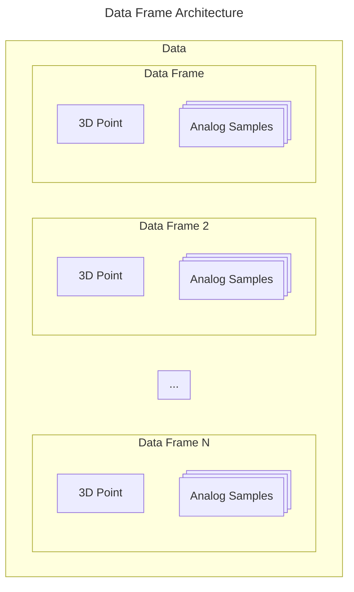
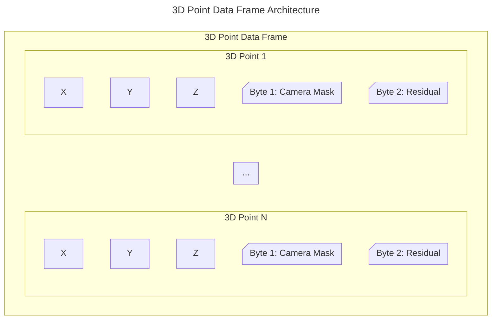
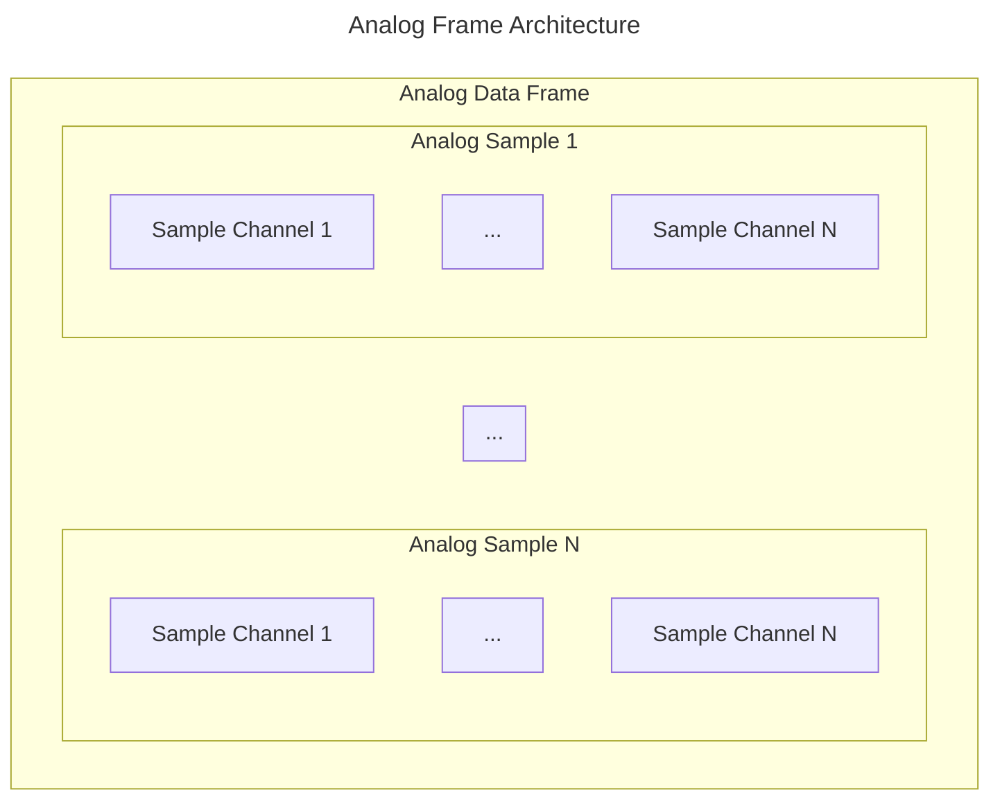

# Data Section

The C3D file format is designed to store 3D point and analog information so that the stored 3D locations (stored as XYZ coordinates, with [Residual](3d-points-residuals.md) and Camera Mask) can be synchronized with any number of analog measurements. 

Information to interpret the 3D Point and Analog data is stored as [Parameters](../parameters/c3d-parameter-section.md). For example the [3D sample rates](../parameters/required/point-rate.md), [analog sample rates](../parameters/required/analog-rate.md), and the number of [sampled 3D markers](../parameters/required/point-used.md) and [analog channels](../parameters/required/analog-used.md). As well as the information documenting the data in each channel, allowing users to determine the structure and contents of the stored data each time that a new C3D file is read.

## Data Frame Structure

The C3D structure for 3D Point and Analog Data assumes that each Data Frame can have one 3D Point Frame and one or more Analog Frame from each analog channel sampled.

To allow data collection systems to maintain synchronization when simultaneously recording 3D and Analog samples, all data samples are interleaved frame-by-frame throughout the C3D data section. While files normally contain both 3D and analog samples, files may contain only 3D point or analog data samples.

While this means that C3D files can only contain data sampled at integer multiples of the 3D frame rate, it means that data storage synchronization is guaranteed and makes it easy to calculate the size and location of individual 3D data frames and their associated analog samples within the C3D file.

The size of the 3D/analog data section is not stored in the C3D file, but it can be calculated using the Parameters information.

## Description

All related 3D point and analog data samples are written as sequential frames starting in the 512-byte block in the C3D file specified by the [POINT:DATA_START parameter](../parameters/required/point-data_start.md). 

If each frame contains both 3D Point and Analog Data, then the 3D Point Data is written first, starting with the first frame of acquired data, followed by multiple Analog Data samples associated with the 3D frame. The number or Analog Data samples is dictated by the number of [analog channel](../parameters/required/analog-used.md) and the [analog acquisition rate](../c3d-header.md#word-10-number-of-analog-frame-per-data-frame). If there is only a single type of data (either 3D point data, or only analog data) then the data section will simply consist of sequential frames of the only type of data samples.

Both analog channels and 3D points stored within the C3D file format are indexed and counted from base “one” – this can occasionally lead to confusion when sampling data from an analog data collection system that counts channel “zero” as
the first analog channel. There is no “Frame 0” or “Analog Channel 0” in a C3D file, the first frame of 3D data is always counted as Frame 1 and the analog channel count always starts with Channel 1.

## 3D Point Data

The C3D file format requires that 3D Point Data values, which counts is defined by the [POINT:USED](../parameters/required/point-used.md) parameter, will be written to the each frame within the 3D data section in the order
that they are listed in the [POINT:LABELS](../parameters/required/point-labels.md) parameter section. As a result, applications
that access the 3D Point Data must determine the storage order and identity of the 3D Points by reading the order of the point labels stored in the parameter section each C3D file. 

The existence of a single point of 3D data in only one frame of a C3D file requires that storage space for this point be allocated in every single frame of the C3D file. This can result in files with a large amount of wasted space if unused, short
trajectories are preserved unnecessarily.

## Analog Data

The Analog samples in each 3D frame are recorded sequentially, as listed
by the [ANALOG:LABELS](../parameters/required/analog-labels.md) parameter section and defined by the [ANALOG:USED](../parameters/required/analog-used.md) and [ANALOG:RATE](../parameters/required/analog-rate.md) counts.

Analog channels are stored in sequence, starting with the first sampled analog channel, which is always channel one. If ten analog channels are sampled once per 3D frame, then the ten analog values are written in sequence after the 3D point data, starting with channel one and ending with channel ten. If there are three samples of analog data per 3D frame then the first ten analog samples will written in sequence, followed by the second set of analog samples and finally the third set of ten analog samples. This will be followed by the next frame of 3D data which will be followed by the next three sets of analog samples associated with the 3D data frame.

It is worth observing here that analog channels are usually stored in sequence starting with the channel one. There is no provision, in the C3D format, to store only ADC channels 2, 8, and 10 and identify them as such. In order to store channel 10, all the channels between 1 and 10 have to be stored. However, since analog channels can be referred to by their [ANALOG:LABELS](../parameters/required/analog-labels.md) assignments, there is no need to store unused analog channels if applications use the [ANALOG:LABELS](../parameters/required/analog-labels.md) parameter to identify channels instead of the physical channel number to identify the individual analog channels. Thus a C3D file could store only the three channels, each identified by a
unique LABELS parameter as C3D analog channels 1, 2, and 3. Applications would then reference each channel by its LABELS, not its original physical channel number.

> There is no provision to store analog channels out of sequence, but there is no need to sample every ADC analog channel.

## Number of Data Frames

Since the [number of frames](https://tss-22.github.io/SHARP3D/api/SHARP3D.C3dFile.html#SHARP3D_C3dFile_GetRightAmountOfFrames) within each C3D file is stored in the C3D file [Parameter Section](../parameters/c3d-parameter-section.md) either as [POINT:FRAMES](../parameters/required/point-frames.md), [POINT:LONG_FRAMES](../parameters/additional/point-long_frames.md) or calculated from [TRIAL:ACTUAL_START_FIELD](../parameters/application/trial-actual_start_field.md) and [TRIAL:ACTUAL_END_FIELD](../parameters/application/trial-actual_end_field.md), there is no “end-of-data” marker. Data is simply written from the first frame to the last frame. It is recommended that any unused storage in the final 512-byte block of the C3D file should be filled with 0x00.

## Data Type: Int16 or Float32

3D point locations and analog data samples may be stored in either signed 16-bit integers or 32-bit floating-point format. Whichever method is selected applies to both the 3D point and the analog data records within the C3D file. If the 3D point
data is stored in floating-point format, then the analog data must also be stored in floating-point format. It is not possible to mix data storage types within a C3D file, as there is only a single flag (the sign of the [POINT:SCALE](../parameters/required/point-scale_factor.md) parameter) that indicates which storage method is used.

> The data type, Int16 or Float32, is set by the [POINT:SCALE](../parameters/required/point-scale_factor.md) parameter sign. A positive sign indicates integer, a negative sign indicates floating-point.

