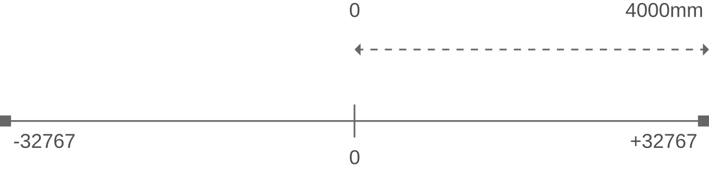
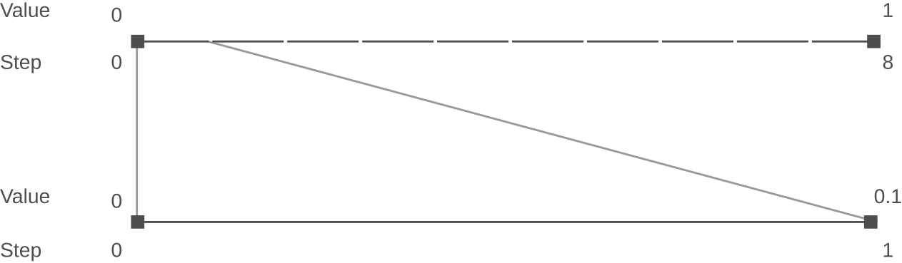

# Scaling Resolution

The C3D format description requires that sensible Analog and 3D Point scale values are used, on the assumption that anyone creating C3D files would realize the folly of choosing inappropriate scale values. The following sections discuss some factors that influence the choice of scaling factors for both 3D Point and Analog data.

## 3D Point Data

In the C3D file format, 3D Point data was originally intended to store marker position data within a calibrated volume. Hence, the data would be homogeneous in the sense that units and relative scales of each point data item would be the same. When [stored in Int16](./3d-point.md#int16) form, the value must be multiplied by the [POINT:SCALE](../parameters/required/point-scale_factor.md) scaling factor ([Header Words 7-8](../c3d-header.md#word-7-8-3d-sacle-factor)) to
yield a physical world value. 

> Generally all 3D data points locations are recorded in millimeters which is the default measurement unit for 3D data in C3D files.

While it is possible to create C3D files that store 3D Point data in meters, feet, or yards this will create compatibility problems for everyone as all C3D applications default to reading the 3D values in millimeters. The units used in C3D file should be documented by the [POINT:UNITS](../parameters/required/point-units.md) Parameter. But note that changing this parameter from “mm” to “cm” or “m” does not affect the 3D data scaling. While applications can be created to internally rescale the data, all C3D files must default to using millimeters for universal compatibility.

The Int16 variable type represents an integer value from -32767 to +32767. The scaling factor is dependent upon the calibration volume and is calculated when the data is stored such that the greatest precision is allowed over the entire volume of interest.

For example, if the largest dimension of the calibration is 4 meters then, assuming the calibrated volume begins at the global (0,0,0) reference location and contains only positive X-direction points with the largest dimension being X=4 meters, the scaling factor for length units expressed in mm would be:

Thus the resolution of all point locations within this C3D file is:

`4000 / 32767 = 0.122mm` 

Clearly, problems can occur when the scale of the stored data reaches that of the scaling factor or resolution. However, as can be seen from the example above, the resolution of integer data within a C3D file in this example is well within even the theoretical limits of most 3D motion measurement systems.

Problems do arise when software applications change the interpretation of the 3D Point data. For example, software applications have used the 3D Point data type to store the results of internal calculations of non-3D information (such as accelerations and moments) derived from calculations in software applications. Depending on the scaling of these calculations, this can produce numbers that cannot be accurately represented with the same [POINT:SCALE factor](../parameters/required/point-scale_factor.md)  required by the 3D point data.

Under these circumstances, moments in a system with dimensional units of mm and force units of N are commonly computed in units of Nmm. This can lead to problems for users who manipulate the 3D point data within the application and then store the results in an integer format C3D file. For instance, users may wish to scale the above mentioned Nmm values by dividing by 1000 to obtain the more commonly used units of Nm and then further dividing by the subject’s body weight for normalization to obtain units of Nm/kg. Such a conversion from Nmm to either Nm or Nm/kg can easily result in values in the order of 1 or even 0.1 which are significant in the context of their biomechanical importance.

> Application generating C3D file need to make educated choice when it comes to scaling resolution.

Using the example above, when storing these values within an Int16 3D Point data variables using the scaling factor of 0.122, only 8 numbers/steps would be available to store values between 0 and 1. All values between 0 and 0.1 would be treated as 0.0 .

The loss of resolution during the conversion of the floating-point values to signed integer values, limited by the [POINT:SCALE factor](../parameters/required/point-scale_factor.md), results in loss of data resolution when the results approach the [POINT:SCALE](../parameters/required/point-scale_factor.md) value due to bad scaling choices.

Since this truncation of the data occurs when the floating-point values are saved to a C3D file using the Int16 formats, the loss of resolution will not be apparent until the C3D file is later reloaded. It is also worth noting that Float32 data that has been filtered may become “noisy” if it is converted to Signed Int16 values. This is due to the loss of precision during the Float32 to Signed Int16 conversion process. This is a particular problem at very low signal levels.

There are several ways to avoid this scaling problem. The best solution is to always be aware of the units and the ranges of interest as well as the resolution of the system and to scale appropriately within any application that may need to generate integerformatted C3D files. 

> Int16 and Float32 C3D files offer virtually identical 3D Point data resolution in all human biomechanics environments.

While floating-point 3D locations can be stored in a Float32 formatted C3D file with a resolution of $0.293 \times 10^{-38} $ mm, it is unlikely that any 3D data collection system can measure a marker or sensor location to sub-atomic resolution, equivalent to the diameter of a single electron.

## Analog Data

You must ensure that all [ANALOG:GEN_SCALE](../parameters/required/analog-gen_scale.md) and [ANALOG:SCALE](../parameters/required/analog-scale.md) Parameters are set to values that scale the Analog data in meaningful ways. Thus force plate data
channels will contain [ANALOG:SCALE](../parameters/required/analog-scale.md) values that are consistent with the scaling calculations that are required by the [force plate TYPE](../parameters/required/force_platform-type.md) description. Other analog channels that containing data with known scaling, for example strain gauge signals, or torque, velocity, and angle data from a dynamometer system etc., should have [ANALOG:SCALE](../parameters/required/analog-scale.md) values that make sense and are described in the [ANALOG:LABELS](../parameters/required/analog-labels.md) and [ANALOG:DESCRIPTIONS](../parameters/required/analog-descriptions.md) entries.

Analog data that does not have fixed, known, scaling values should be scaled in terms of "volts applied to the data collection system ADC input", allowing the data to be viewed and scaled later in sensible terms. Any post-processing scaling can be applied as a separate value, stored in the C3D parameters, allowing the data to be viewed either in terms of the original "recorded values", or displayed "scaled" by third-party software.

It is recommended that all [ANALOG:SCALE](../parameters/required/analog-scale.md) values are chosen appropriately so that the analog data values are preserved if the C3D files are converted between integer and floating-point data types. This means that if the default file storage format is floating-point then all analog data should be scaled to produce numbers within a range of a signed 16-bit integer - specifically −32767 to +32767 when the C3D file is converted to the integer format. Failure to follow this recommendation can result in analog data values being corrupted if the C3D file is converted from floating-point to integer format unless the conversion operation rescales the analog channels.

An example of a potential pre-scaled floating-point storage problem is that when analog samples are stored as floating point values with the [ANALOG:SCALE](../parameters/required/analog-scale.md) set to 1 with the [ANALOG:OFFSET](../parameters/required/analog-offset.md) parameter set to 0, this prevents all users reading the C3D file from determining the original sample values. For example when the ADC range is set to ±10V then a 4 year old child walking over a force plate may be recorded as weighing 15kg but when the ADC range is set ±5V then the 4 year old will be “measured” as weighing 30kg! When the analog data is stored as integers this problem can be discovered and resolved by correcting ADC range error stored as a component of the [ANALOG:SCALE](../parameters/required/analog-scale.md) Parameter, but when data is only stored as pre-scaled floating-point values then the problem cannot be diagnosed or fixed.

Storing analog data using the pre-scaled floating-point format offers no significant advantage because when the analog data is sampled by a 16-bit ADC, both floating-point and integer samples have exactly the same resolution. However the floating-point C3D files will be twice the size of the integer C3D files and scaling the datawithout recording the scaling operation has the potential to result in inaccurate data.