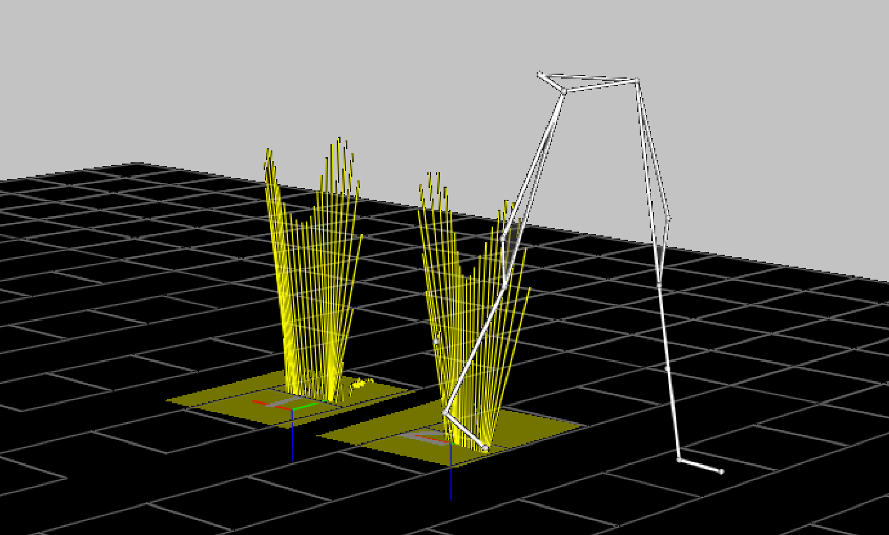

# ANALOG:SCALE

- **Type**: [Required](../../required.md)

- **Locked**: True

> The calculation of the correct ANALOG:SCALE value requires detailed knowledge of the factors that affect the analog sample values.

The individual ANALOG:SCALE values exist to scale each analog data channel and are applied to the scaling calculations regardless of the C3D file format. Setting both the [ANALOG:GEN_SCALE](./analog-gen_scale.md) value and the individual ANALOG:SCALE value to 1.00 effectively removes the scaling factors from the C3D file and is normal when the recorded analog data values are pre-scaled and stored in a floating-point formatted file. Note that this will prevent the analog data being preserved if the C3D file format is ever changed from floating-point file to an integer formatted file without rescaling all of the data.

The ANALOG:SCALE parameter is an array of floating-point values that are applied together with the [ANALOG:GEN_SCALE](./analog-gen_scale.md) parameter value to convert the [analog data](../../../data/analog.md) to physical world values. Normally the units described in the [ANALOG:UNITS](./analog-units.md) parameter. As a result, it is essential that each analog channel have an associated SCALE parameter together with an [OFFSET](./analog-offset.md) parameter so that the correctly scaled analog values can be calculated. The scale calculation applies to both [Real (floating-point)](../../../data/analog.md#float32) and [Integer](../../../data/analog.md#int16) formatted C3D files.

The ANALOG:SCALE parameters convert the analog values stored in a C3D file into volts measured at the ADC inputs via a simple calculation:

$$
\text{ANALOG:SCALE} = \frac{\text{ADC\_range}}{\text{ADC\_resolution}}
$$

The [ANALOG:GEN_SCALE](./analog-gen_scale.md) parameter may be used to apply an additional uniform scale factor to all analog channels. In these discussions it will be assumed that [ANALOG:GEN_SCALE](./analog-gen_scale.md) = 1.0 and therefore has no effect on the results although we will show it in the calculations thus:

$$
\text{ANALOG:SCALE} = \left( \frac{\text{ADC\_range}}{\text{ADC\_resolution}} \right) / \text{ANALOG:GEN\_SCALE}
$$

The `ADC_range` is the actual input range of the ADC card that is used to collect the data. This is normally ±10 Volts, which yields an actual `ADC_range` of 20 Volts which implies that the ADC card can record signals over the range of 10 volts negative to 10 volts positive magnitude, a total range of 20 Volts.

## Recording Analog Data and Computing ANALOG:SCALE

> *This part is about calculating ANALOG:SCALE when recording data to then create a C3D file, but also experimental setup for adequat measurement scale vs experimental needs. This is somewhat of a tangent and disgression. The reader might find useful information, wether concerning C3D file or experimental setup, especially newcomers to ADC and analog recording. This part is relatively confuse, even after trying to edit it to make it more palatable. Other ressources might be more suited to learn about this topic.*

While the default ADC_range is normally 20 Volts, it is common for individual ADC channels for have the ability to select lower ranges by programming a fixed gain within the ADC measurement system for each individual analog channel. An individual channel gain of x2 results in an individual ADC_range of 10 Volts (±5Volts) while a gain of x4 results in an ADC_range of 5 Volts (±2.5Volts). It is best to always think of this change as a change in the range of acceptable ADC input voltages to avoid confusing the individual ADC channel gains with other external equipment gains. It is very important to remember that any signal that exceeds the ADC input range limits will always result in a clipped signal and the loss of data.

The variable `ADC_resolution` is the total number of discrete measurement steps available to measure the ADC input signal, which is related to the ADC precision. An ADC with 12-bit precision can report the value of its input with a resolution of 1 part in 212: this translates to an `ADC_resolution` of 4096. Thus our equation can be written:

$$
\text{SCALE} = \left( \frac{20}{4096} \right) / 1.00 = 0.00488281
$$

> The ADC resolution may affect the offset parameter depending on the encoding method used to store the analog data.

In other words, when [GEN_SCALE](./analog-gen_scale.md) = 1.00 and the ADC has 12-bit precision (212) and a 20 Volt range, the individual ANALOG:SCALE value must be 0.004883 to scale the analog data in the C3D file in volts measured at the ADC input. It is worth noting that, calculated in this manner, the value 0.00488281 volts is the minimum change in input voltage that is required to increase the ADC output count by one. This is another way of saying that the smallest input voltage change that we can detect and record (for the configuration described above) is about 0.0049 volts or 4.9mV. Meaning any signal change less than 4.9mV will not be recorded. This is a limitation of the precision used by the ADC recording method, not something that is inherent to the C3D file format.

There are two ways to increase the measurement sensitivity, either:
- Increase the measurement resolution (i.e., use a 16-bit ADC with 216 bits of precision)
- Add additional amplification to the input signal. 

Increasing the ADC precision usually means changing hardware and software components of the data collection system and generally affects all the analog channels. This can be both expensive and technically challenging. As a result, the common method of increasing measurement
sensitivity is to add amplification to the input signal.

Many modern ADC devices have the ability to internally set gains of x1, x2, x4, and x8 etc. on individual analog channels within the device itself. The gain applied to each analog channel internally will directly affect the ADC_range variable for each channel. For instance, an ADC channel with a nominal ±10 volt input range and an internal ADC_gain of x2 would have an effective input range of ±5 Volts due to the additional amplification. The internal ADC_gain for each individual analog channel can be factored into the ANALOG:SCALE parameter thus:

$$
\text{SCALE} = \left( \frac{\text{ADC\_range}}{\text{ADC\_resolution} \times \text{ADC\_gain}} \right) / \text{GEN\_SCALE}
$$

Using the example of an ADC_gain of x2, will cause the ANALOG:SCALE parameter calculated earlier to be reduced by a factor of 2, thus:

$$
\text{SCALE} = \left( \frac{20}{4096 \times 2} \right) / 1.00 = 0.00244141
$$

In addition to the internal ADC_gain discussed above, many signal sources may have additional amplification that needs to be taken into account. For example, an electromyography system with an amplification of x5000 would produce an output level of ±5 Volts from an input of ±1 mV. This additional Gain can also be factored into the individual ANALOG:SCALE calculations as follows:

$$
\text{SCALE} = \left( \frac{\text{ADC\_range}}{\text{ADC\_resolution} \times \text{ADC\_gain} \times \text{Gain}} \right) / \text{GEN\_SCALE}
$$

### EMG Systems

It is recommended that any device that has a user adjustable gain setting, as is typical with many EMG systems, should be scaled to deliver a signal in the output voltage range of the device. This means that the C3D scale calculation does not have to be adjusted whenever the user changes the connected device gain to deliver a signal in terms of the device output voltage.

However, if the system has a fixed gain, or a preset gain that will not be changed then data can be scaled accurately. For example, to use a case from the physical world, we will connect an external electromyography channel with a fixed gain of x5000 to the ADC system that we have previously described. We will continue to use the same [GEN_SCALE](./analog-gen_scale.md) value of 1.00. Using this 12-bit ADC (internal resolution of 4096) with range of ±10 volts and a gain of x2, produces an ANALOG:SCALE value of 0.0000004883:

$$
\text{SCALE} = \left( \frac{20}{4096 \times 2 \times 5000} \right) / 1.00 = 0.0000004883
$$

Clearly, the individual ANALOG:SCALE values can become very small when the amplification factors are large. This is not always convenient, and under some circumstances can result in significant loss of precision. For example, any application that only read the first six decimal places of the ANALOG:SCALE factor shown above would mistakenly determine the SCALE factor to be 0.000000 with the result that no analog data would be reported.

<!-- 
!!!!!THIS PART IS CRYPTIC AND VERY BADLY WORDED. WE DON4T UNDERSTAND WHAT THE AUTHOR WAS TRYING TO SAY AS IT MIGHT NOT IMPLY UNITS RESCALING BUT SOMETHING ELSE INSTEAD. GO FIGURE. CLASSIC C3D FUN!!!!!  
In all of the examples used above, the [ANALOG:GEN_SCALE](./analog-gen_scale.md) parameter has been assigned a value of 1.00. While this is convenient for the purposes of working these examples, this value is a factor in each of the individual ANALOG:SCALE calculations.
As a result, these values can be re-scaled by using a different [GEN_SCALE](analog-gen_scale.md) value.

For instance, the first calculation above to scale the analog C3D data in volts measured at the ADC input used a [GEN_SCALE](./analog-gen_scale.md) value of 1.00 and produced a SCALE value of 0.004883. If we recalculate the SCALE parameter using a [GEN_SCALE](./analog-gen_scale.md)
value of 0.004883, we obtain an individual ANALOG:SCALE of 1.00 in that example and the prior calculation for an electromyography system now yields an ANALOG:SCALE value of 0.00010006.
 -->

## Load Cells

Many sensors produce an output in terms of units other than volts. In this case, an additional scaling factor must be applied to the scale calculation. The scaling factor can be calculated once some basic information about the sensor is available.

In this example we will calculate the ANALOG:SCALE parameter for a typical load cell used to measure tension and compression so that we record the output in the same units that are used to calibrate the load cell. The load cell data sheet provides the following information for this device:

- Output: 2mV/V

- Excitation: 10.0 VDC

The load cell output is specified in terms of volts output per volt of excitation at full load. In this case, the manufacturer specifies a 10.0 Volt excitation voltage, so the load cell output will be 20mVat full load, which, for this load cell, is 50 pounds. We now have enough information to calculate the sensor calibration factor:

$$
\frac{\text{Output} \times \text{Excitation}}{\text{Range}} = \frac{0.002 \times 10}{50} = 0.0004
$$

This sensor calibration factor can be using in the basic ANALOG:SCALE calculation to produce data values scaled directly in pounds:

$$
\text{SCALE} = \left( \frac{\text{ADC\_range}}{\text{ADC\_resolution} \times \text{ADC\_gain}} \right) / \text{GEN\_SCALE} / 0.0004
$$

Assuming a [GEN_SCALE](./analog-gen_scale.md) value of 1.00, a 12-bit ADC (internal resolution of 4096) with an input range of ±10 Volts, and a gain of x1, this produces an ANALOG:SCALE value of 12.207 that, at a quick glance, appears to be correct. However the sensor output is, even at maximum load, very small and as a result, we have very poor resolution using this sensor and ADC combination. The smallest change in tension or compression that can be recorded is one bit of ADC data. In this case, it would be about 12.2 lbs. In order to achieve a reasonable measurement resolution additional gain is required to amplify the output from the sensor to match the full ADC measurement range. This will, in turn, affect the ANALOG:SCALE parameter value.

Many modern ADC sampling devices can be programmed to use different input ranges by changing the ADC gain. If we use an `ADC_gain` of x8 in the above scale calculations, we can improve the measurement resolution to about 1.5 lbs. This resolution can be further improved by adding an additional gain stage in between the load cell and the ADC.

## Force Plates

The method used for calculating the SCALE values for force plate channels depends on the force plate type as recorded by the parameter [FORCE_PLATFORM:TYPE](../force_platform/force_platform-type.md). The C3D parameters described here accommodate two types of force plate, eight-channel
piezo-electric force plates (e.g. Kistler), and six-channel strain gauge force plates (e.g. AMTI, Bertec and Kyowa-Dengyo).

A strain gauge force platform manufacturer will typically supply data with each force plate that describes how the values measured are affected by the applied forces and moments. This information may be in the form of a single value for each output channel, or alternatively as a matrix of values, which describes how every channel affects every other channel. <!-- !!!!!OMITTED BECAUSE IT IS CONFUSING AND NECESSARY AT THIS STAGE OF THE DISCOURSE!!!!!If we use only the diagonal entries from the calibration matrix then we are ignoring cross-talk terms, which are usually quite small when compared to the elements on the matrix diagonal, and we have just a single sensitivity value for each channel. This is the method used for the six-channel force plates that will be describe first since they are the most widely used.-->The C3D format defines a number of different force plate types to enable the stored analog data from each type to be treated appropriately: 

- **TYPE-1 force plates**: They have three force outputs ($Fx$, $Fy$ and $Fz$) and a $Mz$ and center-of-pressure output ($Px$ and $Py$).

- **TYPE-2 force plates**: They provide three force outputs and three moment outputs ($Mx$, $My$, $Mz$) and scale these signals using a single scaling factor applied to each analog channel.

- **TYPE-3 force plates**: They provide force outputs from the force plate corners

- **TYPE-4 force plate**s: They are similar to **TYPE-2** but use the entire cross-talk matrix to scale the output data.

For example, a **TYPE-2 force plate** sensitivity matrix looks like this:

|  | $Vfx$ | $Vfy$ | $Vfz$ | $Vmx$ | $Vmy$ | $Vmz$ |
| --- | --- | --- | --- | --- | --- | --- |
| $Fx$ | **0.643** | -0.003 | 0.009 | 0.009 | 0.000 | -0.005 |
| $Fy$ | 0.001 | **0.642** | 0.000 | -0.003 | -0.006 | 0.007 |
| $Fz$ | 0.010 | 0.011 | **0.170** | 0.001 | 0.009 | -0.001 |
| $Mx$ | 0.015 | -0.001 | 0.008 | **1.352** | 0.004 | 0.001 |
| $My$ | -0.008 | 0.005 | -0.011 | 0.000 | **1.361** | 0.000 |
| $Mz$ | 0.004 | -0.001 | 0.009 | -0.004 | -0.002 | **2.562** |

The matrix is ordered as $Fx$, $Fy$, $Fz$, $Mx$, $My$, $Mz$ with all values in terms of microvolts produced per Newton, per volt of excitation (mV/N/V) applied to the force plate strain gauges. Since this is a strain gauge force plate, the actual output level from each channel is dependent on the excitation voltage applied to the strain gauge bridge. Typically, the excitation voltage is in the range of five to ten volts. An example is provided below.

The ANALOG:SCALE value for the first channel ($Fx$ above), will be given by the expression:

$$
\text{SCALE} = \left( \frac{\text{Voltage\_range}}{\text{resolution} \times \text{gain} \times \text{ex} \times F_x} \times 1000000 \right) / \text{GEN\_SCALE}
$$

Where `Voltage_range` is the total ADC input range in volts (e.g. “20” for an ADC with an input range of ±10 Volts), resolution is the total ADC resolution in bits, `ex` is the platform excitation voltage, and `gain` is the gain setting on the force platform amplifier for that particular channel (in this example, x4000). The calculated result must be multiplied by 1000000 since the calibration matrix values are supplied in microvolts (μV).

Note that different channels may have different `Voltage_range` and gain values. These will depend on the type of hardware, and the hardware and software settings in effect when the data were collected. Since the values of these settings are used in the force plate scaling calculations it is vital that they are not changed once the calculations have been performed and the results used to scale the recorded data. As with all analog SCALE values, the [GEN_SCALE](./analog-gen_scale.md) parameter is included in the calculation:

$$
\text{SCALE} = \left( \frac{20}{4096 \times 4000 \times 10 \times 0.643} \times 1000000 \right) / 1.00 = 0.1898
$$

The application of this scale factor to the stored [analog data (see the analog scale calculations for details)](../../../data/analog.md) will result in an output having the units of newtons applied. Note that you must enter all force plate ANALOG:SCALE factors as negative values to
produce an output in terms of reactive force.

If the calibration values are supplied in units of Newton-meters per volt (Nm/V) for the force moments, and the measurement units specifying the locations of your reference markers are in millimeters, then you must convert the values referring to moments to Newton-millimeters per volt (Nmm/V). This conversion is achieved by multiplying the ANALOG:SCALE results for the moment channels by 1000.

If a matrix was not supplied then we would be given just the six major diagonal elements from top left to bottom right, in bold in the **TYPE-2 force plate** sensitivty matrix above. These elements are the only parts of the matrix that are used in calculating the SCALE values for **TYPE-1** and **TYPE-2 force plates**.

**TYPE-3 force plates** (Kistler piezo-electric plates) do not use a cross-talk matrix, or produce any moment outputs. Instead, these plates provide eight force channels with outputs that are measured using electrical charge in terms of pico coulombs per newton (pC/N) applied.

The ANALOG:SCALE values for **TYPE-3 force plate** are calculated using information provided by the manufacturer about the sensitivity of the force plate transducers, together with the, user-controlled, channel gains of the charge amplifier supplied with each force plate. **TYPE-3 force plates** produce three sets of force output signals, each with a separate calibration value: these are $Fx$1-2, $Fx$3-4 and $Fy$1-4, $Fy$2-3 together with $Fz$1, $Fz$2, $Fz$3, and $Fz$4. Each force plate is supplied with three separate calibration values that apply to the $Fx$, $Fy$, and $Fz$ channels.

For example:

- $Fx$: 7.87 pC/N
- $Fy$: 7.85 pC/N
- $Fz$: 3.89 pC/N

Using the example above with a calibration of 7.87 pC/N and a charge amplifier range of 5000pC (fs_range) for a 10 volt output yields a scale factor would be:

$$
\text{SCALE} = \left( \frac{\text{Voltage\_range}}{\text{resolution} \times \text{calibration}} \times \left( \frac{\text{fs\_range}}{10 \times \text{gain}} \right) \right) / \text{GEN\_SCALE}
$$

Where resolution is the ADC resolution (4096 for a 12-bit ADC), `Voltage_range` is the ADC input range, and `gain`, if any, is the individual analog channel gain. With a [GEN_SCALE](./analog-gen_scale.md) of 1.00 this gives:

$$
\text{SCALE} = \left( \left( \frac{20}{4096 \times 7.87} \right) \times \left( \frac{5000}{10 \times 1} \right) \right) / 1.00 = 0.310217
$$

Thus, the $Fx$ SCALE value is 0.310 newtons per volt, which is entered as a negative value to produce an output in terms of reactive force.

**TYPE-4 force plates** are mechanically and electrically identical to **TYPE-2 force plates**, and are a special case of **TYPE-2 force plates** that use a slightly different cross-talk correction method. **TYPE-4 force plates** use the entire calibration matrix to calculate their output. As a result, the output from a **TYPE-4 force plate** is slightly more accurate then when only the major diagonal information is used. The ANALOG:SCALE parameters for **TYPE-4 force plates** are calculated as follows:

$$
\text{SCALE} = \left( \frac{\text{Voltage\_range}}{\text{resolution} \times \text{gain} \times \text{ex}} \times 1000000 \right) / \text{GEN\_SCALE}
$$

The calibration matrix (the inverse matrix of the sensitivity matrix used by **TYPE-2 force plates**) should be entered in the [FORCE_PLATFORM:CAL_MATRIX](../../additional/force_platform/force_platform-cal_matrix.md) parameter. The conversion from volts to newtons will occur when the calibration matrix is applied to the data as an additional step.

$$
\text{SCALE} = \left( \frac{20}{4096 \times 4000 \times 10} \times 1000000 \right) / 1.00 = 0.12207
$$

Note that different force plate channels may have different voltage ranges and gains. These will depend on the type of hardware, and the hardware and software settings in effect when the data were collected. If the calibration values are supplied in units of Newton-meters per volt (Nm/V) for the force moments, and the measurement units specifying the locations of your reference markers are in millimeters (mm), then you must convert the values referring to moments to Newton-millimeters per volt (Nm/V). This conversion is achieved by multiplying the last three rows of the calibration matrix by 1000.

<!--!!!!!WE DON'T KNOW WHAT IS THIS AND IF IT IS GOOD OR ANYTHING ABOUT IT. JUST IN CASE, WE WON'T PROMOTE ANYTHING IN THE DOC THAT WE DON'T KNOW OF!!!!! This simple test is available in a commercial package that uses a test device (MTD-3) and software (CalTester) to provide a report of the force plate performance. (sic. *SHARP3D doesn't endorse or promote this products.*) -->

A sensitive test of the force plate performance may be carried out using a stick about one meter long with markers at locations a short distance from either end. After the video system has been fully calibrated, force and 3D data is collected while one end of the stick is placed on the force platform and a force directed along the stick is applied to the upper end of the stick. The upper end of the stick should be moved while the force is continually applied in order to create varying angles of the stick with the FP surface. If the force platform is correctly set up, the force vector and a line joining the two markers should coincide for the full range of motion of the stick.