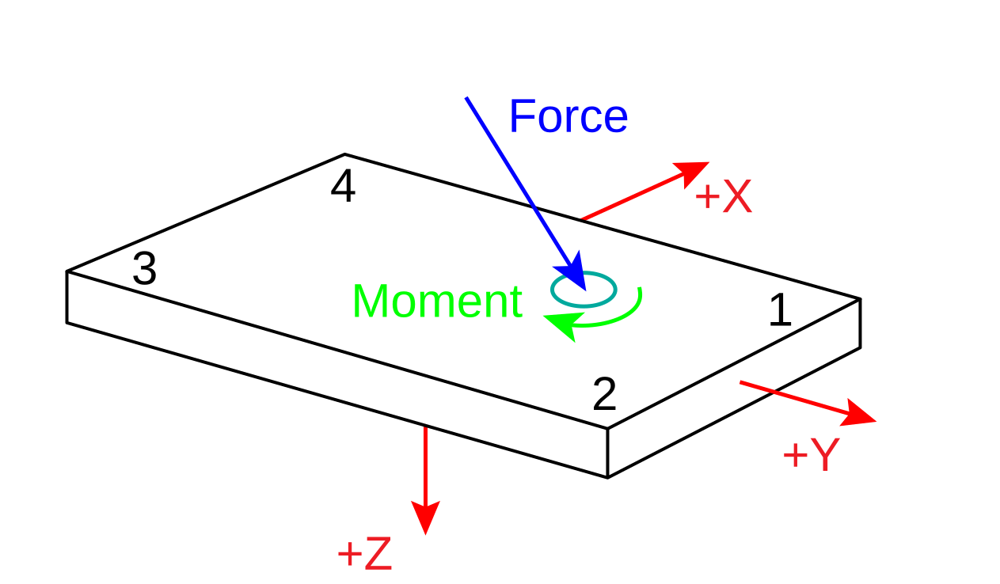

# FORCE_PLATFORM:CORNERS

- **Type**: [Required](../../required.md)

- **Locked**: False

The FORCE_PLATFORM:CORNERS parameter is a floating-point array of dimension \[3,4,USED\] that record the locations of the force platform corners in the reference coordinate system, measured in [POINT:UNITS](../point/point-units.md). This parameter is used by any graphics application to draw the force platforms, force vectors, and center of pressure information in the correct locations relative to the 3D point data.

> Despite the official documentation stipulating that 

The first dimension specifies the X, Y, or Z coordinate.

The second dimension specifies the corners.

The corners are numbered from 1 to 4 and refer to the quadrant numbers in the X-Y plane of the force platform coordinate system (not the 3D point reference coordinate system). 

With respect to the force plate coordinate system ($X$, $Y$, $Z$):
- Corner 1: \[+1, +1, 0\]
- Corner 2: \[-1, +1, 0\]
- Corner 3: \[-1, -1, 0\]
- Corner 4: \[+1, -1, 0\]

The third dimension specifies the force plates index, in reference to [FORCE_PLATFORM:USED](./force_platform-used.md). Its value is therefore 

<!--!!!THIS MUST BE A MISTAKE??!!! The third dimension of the CORNERS array (USED) must be equal to or greater than the value of the [FORCE_PLATFORM:USED](./force_platform-used.md) parameter. -->