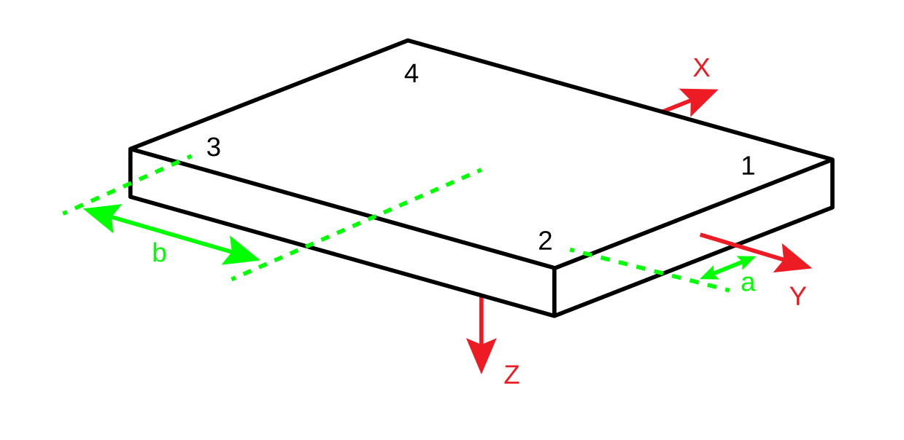

# FORCE_PLATFORM:ORIGIN

- **Type**: [Required](../../required.md)

- **Locked**: False

The FORCE_PLATFORM:ORIGIN parameter is a floating-point array of size \[3,USED\] whose interpretation depends on the type of force plate used, as set by the [TYPE](./force_platform-type.md) parameter. You should be able to find all the information that you need to calculate the correct ORIGIN values in the appropriate force plate manual supplied by the force plate manufacturer.

The ORIGIN vector is defined to enable the transformation of the force vectors, as measured by the transducers, into the laboratory coordinate system via the center of the working surface of each force plate defined by the CORNERS parameters. Normally the force plate coordinate system origin is below the surface of the platform and the force plate coordinate system $Z$-axis is directed downwards, so that the sign entered in ORIGIN(3) will be negative. The force platform coordinate system depends upon the signals that are output from the transducers, and may need to be modified to provide a standard [right-handed coordinate system](https://en.wikipedia.org/wiki/Right-hand_rule), which ORIGIN is assumed to be. Assuming a [left-handed coordinate system](https://www.evl.uic.edu/ralph/508S98/coordinates.html) will change the sign of one of the components.

In general, the vertical force plate ORIGIN component will be below the surface of the force plate and many applications may experience problems if this is entered incorrectly. While many motion capture calibration systems place a jig on the force plate in an attempt to synchronize the force platform location to the 3D collection volume, this calibration does not affect the force platform origin parameters which must be entered when a force plate is defined in the data collection environment.

> The FORCE_PLATFORM:ORIGIN parameter describes the **origin within the force platform location**, recorded in the C3D file [FORCE_PLATFORM:CORNERS](./force_platform-corners.md) parameterand so it is not affected by any changes in the 3D data collection volume location.

All ORIGIN distance units must be recorded in [POINT:UNITS](../point/point-units.md), as used to express the locations of the [FORCE_PLATFORM:CORNERS](./force_platform-corners.md) in the 3D coordinate system. It is important to note that every distance in a C3D file must be expressed in the same units.

# [TYPE-1](./force_platform-type.md#type-1)

For a [TYPE-1](./force_platform-type.md#type-1) force platform only the 3rd (ORIGIN(3,)) component is used, while any values stored in ORIGIN(1,) and ORIGIN(2,) are ignored.

ORIGIN(3,) must contain the displacement from the force plate coordinate system origin to the working surface of the force platform. 

Normally the force plate coordinate system origin is below the surface of the platform and the coordinate system z-axis is directed downwards, so that the sign of the distance entered in ORIGIN(3,) will be negative.

# [TYPE-2](./force_platform-type.md#type-2)

For a [TYPE-2](./force_platform-type.md#type-2) force platform, the ORIGIN parameter defines a vector pointing from
the origin of the force plate coordinate system, the point where an application of $F_x$,
$F_y$, or $F_z$ will produce zero moment signals, to the point at the geometric center of
the physical force platform working surface. 

The vector described by the ORIGIN parameter must be expressed in the force platform coordinate system and locates the center of the working surface of the force plate within the force plate coordinate system. This means that when the force plate is mounted in the floor, the $Z$ component of this vector will be negative when the force plate origin lies below the physical surface of the force plate.

> The origin of the force platform coordinate system will always lie below the physical top surface of the force platform.

The force plate offset vector described by the ORIGIN parameter should locate the center of the working surface of the plate relative to the force plate measurement origin and in the force plate coordinate system. The direction of the force plate coordinate system axis ($Z$ axis) that is normal to the working surface of the force plate (usually the vertical axis but the force plate could be on its side) is directed away from the working surface of the force plate. Thus, you must travel in a negative $Z$ direction in the force plate coordinate system to reach the working surface.

Entering the wrong values for the ORIGIN parameter may produce errors in any application that calculates center of pressure, power, and moments as these calculations will assume that the force plate origin is above the force plate surface, based on the incorrect ORIGIN value.

> Failing to store the sign of the FORCE_PLATFORM:ORIGIN values correctly is a common error in many C3D files.

> The information supplied by the force plate manufacturer must be read carefully when the values of the ORIGIN parameters are determined. Where several force plates are used it is important to remember that the values for each plate and manufacturers calibration descriptions may change from one plate to another depending on the calibration information supplied with each plate.

The original [AMTI](https://www.amti.biz) calibration method describes the origin of the force plate coordinate system as an offset to the geometric center of the top surface of the plate, thus describing the $Z$ offset as a positive number. 

However, calibration data from more recent force platforms describe the location of the force plate coordinate system as an offset from the geometric center of the top surface of the plate resulting in a negative $Z$ offset value in the manufacturer’s calibration information. The change in the descriptive convention affects only the sign of the $Z$ offset; The force plate coordinate system does not change.

|  | Older AMTI values | Current AMTI values | Correct Origin Signs |
| --- | --- | --- | --- |
| X | 3.9 | -3.9 | -3.9 |
| Y | -4.6 | 4.6 | 4.6 |
| Z | 40.2 | -40.2 | -40.2 |

The older [AMTI](https://www.amti.biz) documentation locates the force plate origin relative to the middle of the working surface and reported this vector in terms of the force plate coordinate system. As a result the sign of the origin values supplied in the [AMTI](https://www.amti.biz) calibration information needed to be changed when the values were entered into the C3D format ORIGIN parameters to align the force plate coordinate system with typical motion data collection coordinate systems, something that was often overlooked during the initial data collection configuration. Current [AMTI](https://www.amti.biz) calibration documentation provides origin signs that match the description of the ORIGIN parameter.

C3D files created by many early [Vicon systems](https://www.vicon.com/) may not store the correct ORIGIN values for TYPE-2 force plates because of errors in the installation documentation. Users who upgrade their laboratories from equipment installed prior to this time may continue to store the wrong values unless the force plate’s calibration is verified and the correct force platform origin values are entered.

# [TYPE-3](./force_platform-type.md#type-3)

For a [TYPE-3](./force_platform-type.md#type-3) force platform, these values record the sensor offsets. 

- ORIGIN(1,) must contain the distance between the transducer axes and the force platform y-axis.

- ORIGIN(2,) must contain the distance between transducer axes and the force platform
x-axis. 

- ORIGIN(3,) should contain the distance between the force plate origin and the surface of the force platform.

Since the force platform $Z$-axis projects down, the ORIGIN(3,) value will normally be
negative as it stores the distance within the force plate coordinate system.

> Refer to the manufacturer’s specifications for the force platforms being used.

For most plates, you can assume that ORIGIN(1,) is half inter-transducer distance in $X$- direction (shown as $a$ below) and ORIGIN(2,) is half inter-transducer distance in $Y$-direction (shown as $b$ below). ORIGIN(3) can be a little harder to find but will be provided in the manufacturer’s documentation. 

Remember that all distance units must be the same as were used to express the locations of the 3D points in the laboratory coordinate system.

# [TYPE-4](./force_platform-type.md#type-4)

A [TYPE-4](./force_platform-type.md#type-4) force platform stores the FORCE_PLATFORM:ORIGIN parameter in [exactly the same way](#type-2) as a [TYPE-2](./force_platform-type.md#type-2) force platform. The ORIGIN parameter must hold the components of the vector pointing from the origin of the force plates coordinate system to the point at the geometric center of the working surface of the force platform. This vector is always expressed in the force platform coordinate system.